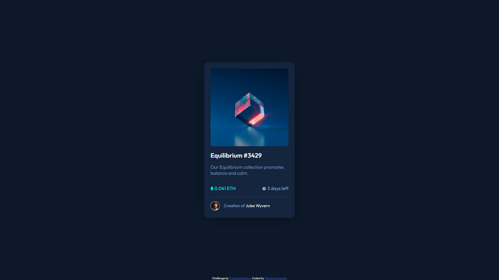

# Frontend Mentor - NFT preview card component solution

This is a solution to the [NFT preview card component challenge on Frontend Mentor](https://www.frontendmentor.io/challenges/nft-preview-card-component-SbdUL_w0U). Frontend Mentor challenges help you improve your coding skills by building realistic projects.

## Table of contents

- [Overview](#overview)
  - [The challenge](#the-challenge)
  - [Screenshot](#screenshot)
- [My process](#my-process)
  - [Built with](#built-with)
  - [What I learned](#what-i-learned)
  - [Continued development](#continued-development)
- [Author](#author)
- [Acknowledgments](#acknowledgments)

## Overview

### The challenge

Users should be able to:

- View the optimal layout depending on their device's screen size
- See hover states for interactive elements

### Screenshot

## My process

### Built with

- Semantic HTML5 markup
- CSS custom properties
- Flexbox
- CSS Grid
- Mobile-first workflow

### What I learned

This was a relatively simple project with not a lot of content to display, it took me about 1:30hr which is way more than it should have been so i can see that i need to work faster.
I learned a bit more about box-shadow and background images.

### Continued development

I can definetely see that i need to work on understanding designs and painting the picture of the structure in my head.

## Author

- Frontend Mentor - [@yohannesakd](https://www.frontendmentor.io/profile/yohannesakd)

## Acknowledgments

Big thanks to Kevin Powell's Youtube channel, great place to learn a lot about HTML and CSS.
